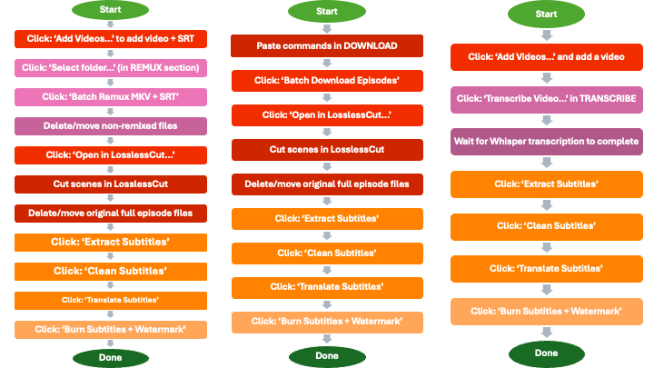

# SP Workshop


[](../../releases)
[](LICENSE)
[](https://www.python.org)
[](#installation)

## Video processing studio GUI 🎬 

🌐 SP Workshop is a desktop GUI for extracting, translating, transcribing, and burning subtitles into videos.

🏳️‍🌈 It was created to make international WLW / sapphic content more accessible, but it works for any audiovisual media.

#### Intended users
SP Workshop is built for:

- Subtitle editors and translators
- Archivists and fandom preservation projects
- Anyone who wants subtitles in the language they actually want

No command-line knowledge is required.

#### Skill level
Beginner-friendly.

If you can install software on your laptop, you can use SP Workshop.

## Features

| Function | Description |
|--------|-------------|
| **Download** | Batch download episodes using N_m3u8DL-RE, add local videos, open files in LosslessCut for trimming |
| **Subtitles** | Extract subtitles from MKV files, clean formatting, translate subtitles |
| **Process Video** | Burn subtitles into video with optional watermarks, output at 720p or 1080p |
| **Transcription** | Generate subtitles from audio using Whisper when no subtitles exist |
| **Remuxing** | Tree-based file and track view, add external SRT files, remux MKV or MP4, split audio tracks |


## Installation

### Prerequisites

- **Python 3.9 or higher**
  Download from [python.org](https://www.python.org/downloads/) and make sure it is added to PATH during installation.

Download SP Workshop from:
👉 [GitHub Releases](https://github.com/slappepolsen/sp-workshop/releases)

Select **Source code (zip)** under Assets.

---

## macOS

1. Open **Terminal**
2. Navigate to the project folder
   ```bash
   cd path/to/sp-workshop
   ```
3. Create and activate a virtual environment
   ```bash
   python3 -m venv .venv
   source .venv/bin/activate
   ```
4. Install dependencies
   ```bash
   pip install -r requirements.txt
   ```
5. Install FFmpeg (required)
   ```bash
   brew install ffmpeg
   ```
6. Install N_m3u8DL-RE (optional, for downloads)
   - Download from https://github.com/nilaoda/N_m3u8DL-RE/releases
   - Add the executable to your PATH
7. Run the app
   ```bash
   python3 video_app_v8.py
   ```

---

## Windows

1. Open **Command Prompt**
2. Navigate to the project folder
   ```bash
   cd path\to\sp-workshop
   ```
3. Create and activate a virtual environment
   ```bash
   python -m venv .venv
   .venv\Scripts\activate
   ```
4. Install dependencies
   ```bash
   pip install -r requirements.txt
   ```
5. Install FFmpeg and add it to PATH
6. Install N_m3u8DL-RE (optional, for downloads)
7. Run the app
   ```bash
   python video_app_v8.py
   ```

---

## Linux

1. Create and activate a virtual environment
   ```bash
   python3 -m venv .venv
   source .venv/bin/activate
   ```
2. Install dependencies
   ```bash
   pip install -r requirements.txt
   ```
3. Install FFmpeg
   ```bash
   sudo apt install ffmpeg
   ```
4. Install N_m3u8DL-RE (optional)
5. Run the app
   ```bash
   python3 video_app_v8.py
   ```

---

## Getting Started

On first launch, a setup wizard checks whether required tools are installed and points out anything missing. You can skip this and configure everything later in **Settings**.

### Directory Structure

By default, SP Workshop creates:

- `~/VideoProcessing/downloads/`  
  Raw video files and transcribed subtitles

- `~/VideoProcessing/subtitles/`  
  Extracted, cleaned, and translated subtitle files

- `~/VideoProcessing/output/`  
  Final processed videos

All paths can be changed in **Settings**.

### Configuration:*
Click *Settings* to configure:

- **Google Gemini API Key**: required for subtitle translation. Get one from [aistudio.google.com/app/apikey](https://aistudio.google.com/app/apikey) and paste it into Settings.
- **Watermark files** (optional): PNG files for 720p and 1080p output.
  - **720p watermark:** it's *just* a transparent PNG at 1280×720, with your text or logo at about 20% opacity
  - **1080p watermark:** transparent PNG at 1920×1080, same idea
  - Watermarks can be toggled on or off in Settings
- **Directory paths**: choose where downloads, subtitles, and output files are stored.

## Workflows

The whole point of this is to make WLW/sapphic/lesbian content accessible for everyone in the world. You know, extracting subtitles, translating them, processing videos with burned-in subtitles and watermarks. All that good stuff, but with way fewer clicks.

SP Workshop supports three main workflows depending on your starting material.



*From left to right: Workflow 1 (External Video + Separate SRT), Workflow 2 (Batch Downloader), Workflow 3 (Whisper Transcription)*

| Workflow | Best For |
|--------|----------|
| **Remux** | Video files with separate subtitle tracks |
| **Batch Download** | Downloading full episodes or series |
| **Transcribe** | Creating subtitles when none exist |


## Troubleshooting

- **PyQt5 not found**: `pip install PyQt5`
- **FFmpeg not found**: Install FFmpeg and ensure it is in PATH
- **N_m3u8DL-RE not found**: Download and add to PATH
- **Translation fails**: Check API key and internet connection
- **Whisper issues**: Ensure `whisper_auto.sh` exists and is executable

Check the app log window for detailed error messages.


## System Requirements

- **macOS 10.14+** (primary platform - fully tested)
- Or **Windows/Linux** - The app should work, but these platforms haven't been as extensively tested. If you're on Windows or Linux and manage to get it working (or run into issues), please let me know! I'd love to hear about your experience and can help troubleshoot.
- Python 3.9 or higher
- FFmpeg (latest version recommended)
- N_m3u8DL-RE (for downloads, if you plan to use the batch downloader)
- Internet connection (only for translation and downloading, the rest is local)

## Documentation
- [batchdownloader_guide.md](batchdownloader_guide.md) - Batch downloader quick reference
- [CHANGELOG.md](CHANGELOG.md) - Version history

## Support

I've received messages asking about donations - thank you, but I don't want any money! The best way to support this project is to try it out and let me know what you think. Your feedback is all I need :)

## License

This project is licensed under the [MIT License](LICENSE).

Made with ❤️ by [@slappepolsen](https://x.com/slappepolsen)

[](https://x.com/slappepolsen)

[](https://github.com/slappepolsen/sp-workshop)

