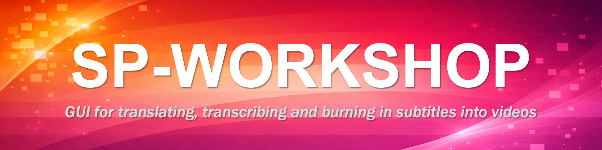

# SP Workshop



[](https://github.com/RichardLitt/standard-readme)
[](https://github.com/slappepolsen/sp-workshop/releases)
[](LICENSE)
[](https://www.python.org/downloads/)
[](INSTALL.md#installation)

Desktop GUI for **extracting**, **translating**, **transcribing**, and **burning** subtitles into videos.

SP Workshop was created to make international WLW / sapphic content more accessible, and it works for any audiovisual media. 

## Table of Contents

- [SP Workshop](#sp-workshop)
	- [Table of Contents](#table-of-contents)
	- [What the app does](#what-the-app-does)
	- [Install](#install)
	- [Usage](#usage)
		- [Run from source](#run-from-source)
		- [Pre-built app (experimental)](#pre-built-app-experimental)
	- [Contributing](#contributing)
	- [License](#license)

## What the app does

| Function | Description |
|----------|-------------|
| **Subtitles** | Extract subtitles from MKV files, clean formatting, translate subtitles |
| **Process Video** | Burn subtitles into video with optional watermarks, output at 720p or 1080p |
| **Transcription** | Generate subtitles from audio using Whisper when no subtitles exist |
| **Remuxing** | Tree-based file and track view, add external SRT files, remux MKV or MP4, split audio tracks |


## Install

**Requirements:** **Python 3.12** and **FFmpeg** on your `PATH` when running from source. Platform support: **macOS**, **Windows**, and **Linux**.

- **Recommended:** follow **[INSTALL.md](INSTALL.md)**. In short: run from source (most reliable), optional pre-built apps, launcher scripts, and common PATH issues.
- **Quick start:** download **Source code (zip)** or assets from **[Releases](https://github.com/slappepolsen/sp-workshop/releases)**.

Pre-built apps are **experimental**; if they fail on your machine, use run-from-source instructions in [INSTALL.md](INSTALL.md).

## Usage

### Run from source

From the project directory:

**macOS / Linux**

```bash
cd /path/to/sp-workshop

python3.12 -m venv .venv
source .venv/bin/activate

pip install -r requirements.txt
python3 app.py
```

**Windows**

```bat
cd \path\to\sp-workshop

py -3.12 -m venv .venv
.venv\Scripts\activate

pip install -r requirements.txt
python app.py
```

You can also use the **launcher scripts** after dependencies are installed (see [INSTALL.md](INSTALL.md)).

If `python3.12` is not available as a command, install Python 3.12 from [python.org](https://www.python.org/downloads/) and ensure it is on `PATH`, or use `py -3.12` on Windows.

### Pre-built app (experimental)

Download the DMG, ZIP, or tarball for your OS from **[Releases](https://github.com/slappepolsen/sp-workshop/releases)**. Details, filenames, and Gatekeeper / SmartScreen notes are in **[INSTALL.md](INSTALL.md#pre-built-app-experimental)**.

## Contributing

[Issues](https://github.com/slappepolsen/sp-workshop/issues) and [pull requests](https://github.com/slappepolsen/sp-workshop/pulls) are welcome.

## License

Copyright (C) 2026 slappepolsen

This project is licensed under the GNU Affero General Public License v3.0.
See the [LICENSE](LICENSE) file for details.

**Made with ❤️ by [@slappepolsen](https://x.com/slappepolsen)**
